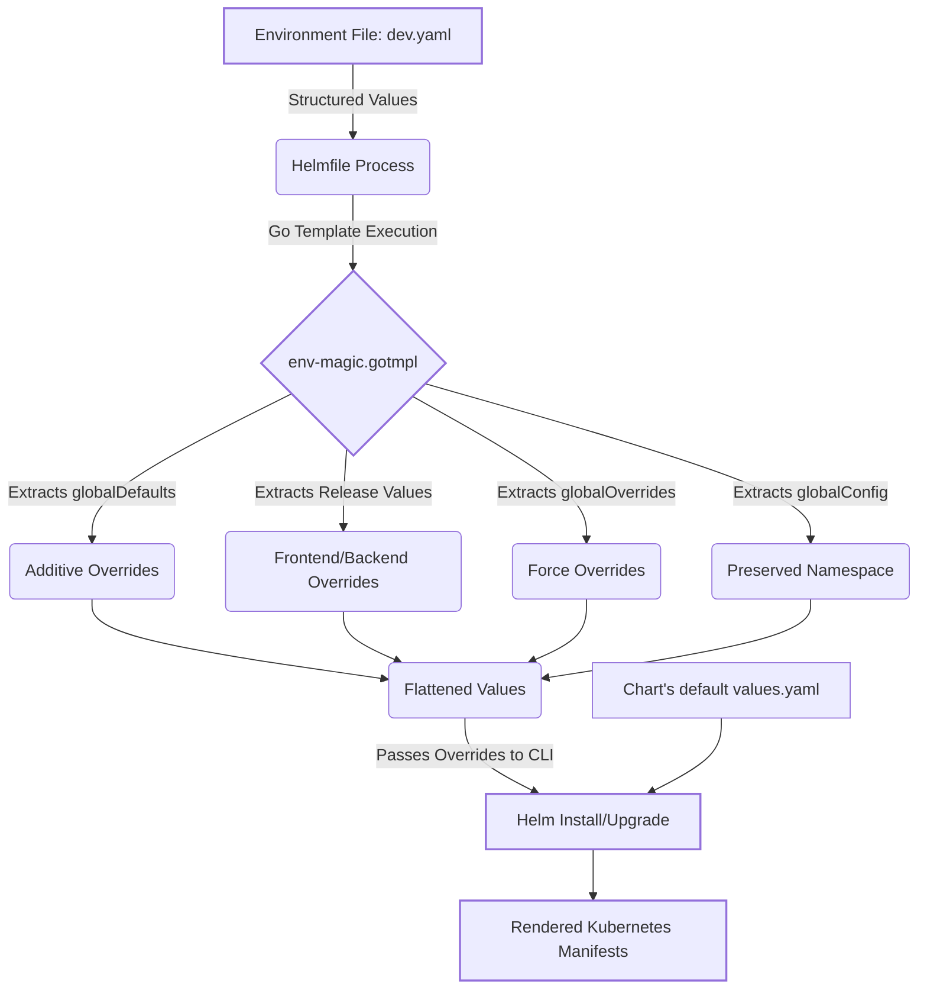
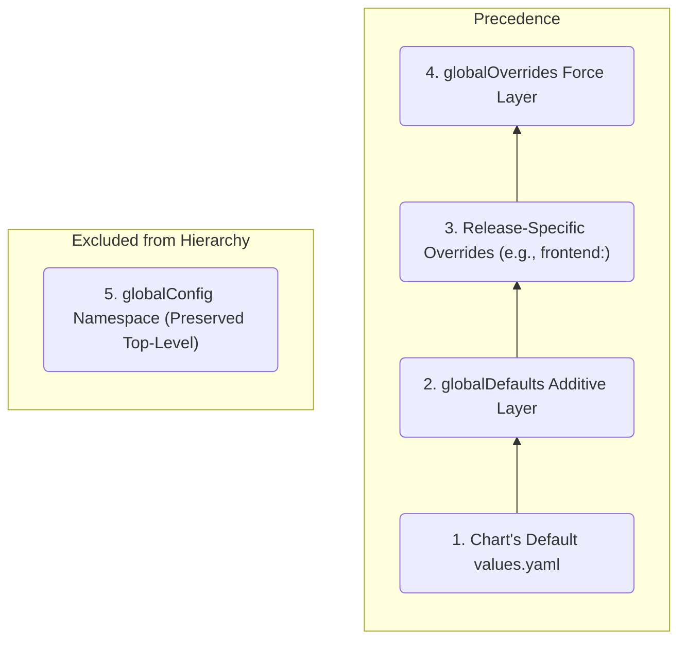

# DevOps Helmfile Weird Values

This repository demonstrates a clean, intuitive pattern for handling and deep-merging values across multiple environments in `helmfile`.

## Microservice Chart Structure

In modern cloud-native architectures, managing complex dependencies requires strict logical boundaries. As documented in the thesis, this deployment strategy adheres to a distinct **"One Chart Per Microservice"** model:
- **1:1 Mapping:** Each business service runs exactly one dedicated Helm chart.
- **Component Nesting:** For microservices requiring multiple internal components (e.g., an `inventory-service` needing both a `backend` deployment and a strictly coupled `database`), values are nested securely under component-specific keys.

By isolating services into dedicated charts, fault isolation is guaranteed, and independent lifecycle management is preserved.

### Structure Examples

Below are two concrete examples visualizing this strategy:

**1. Simple Service Target (e.g., `frontend-chart/values.yaml`)**
A standard, standalone frontend deployment mapped cleanly with no internal dependencies:
```yaml
replicaCount: 1

image:
  repository: localhost:5000/nginx-frontend
  tag: latest
  pullPolicy: IfNotPresent

service:
  type: ClusterIP
  port: 80
```

**2. Multi-Component Service Target (e.g., `inventory-service-chart/values.yaml`)**
A complex business service strictly coupled to its own internal state, safely nested under component-specific keys (`app:` and `database:`):
```yaml
app:
  name: inventory-service
  port: 8080
  image: "localhost:5000/inventory-service:latest"

database:
  name: inventorydb
  user: inventoryuser
  port: 5432
  image: "postgres:17.5"
```

## The Unified Values Management Strategy

However, passing environment-specific configurations into this strict component structure using standard Helmfile practices typically requires writing cumbersome Go templates per release or maintaining fragmented override files.

This repository solves that problem by replicating the merging behavior of **umbrella Helm charts**. It uses a single template (`env-magic.gotmpl`) to implement a robust 4-tier value hierarchy and flattening engine, allowing strict precedence control via Go templates.

This mechanism ensures that the unified environment configurations (which dictate the values for *all* microservices in one place) dynamically flatten to match the native `values.yaml` structure expected by the individual microservice charts.

### The Value Processing Workflow

The typical Helmfile approach requires separate YAML override files for every chart per environment. Our architecture introduces a single source of truth (e.g., `dev.yaml`), processing the nested release values and merging them according to strict precedence rules before passing them on to the Helm CLI.



### How `env-magic.gotmpl` Logic Works
The template performs a top-down merge with the following overwrite precedence (from lowest to highest):

1. **`globalDefaults`**: Additive baseline overrides configured in Helmfile. 
2. **Release-Specific Values**: Specific settings targeted for the current release (matches `.Release.Name`). These explicitly overwrite the `globalDefaults`.
3. **`globalOverrides`**: Final strict overwrites applied universally with the highest precedence.
4. **`globalConfig`**: A specially preserved namespace that is seamlessly passed natively down to the charts without being flattened.



### Complete Environment Example (From Thesis)
To illustrate how all four tiers function simultaneously within a unified environment, consider the following comprehensive `dev.yaml` explicitly defining baseline settings alongside release-specific and forced configurations:

```yaml
# environments/dev.yaml - Complete environment configuration
globalConfig:
  environment: dev
  domain: dev.example.com
  cluster: k8s-dev-01

globalDefaults:
  replicaCount: 1
  image:
    pullPolicy: IfNotPresent
  resources:
    requests:
      cpu: "100m"
      memory: "128Mi"

globalOverrides:
  monitoring:
    enabled: true
  logging:
    level: DEBUG

# Release-specific configurations
frontend:
  replicaCount: 2
  image:
    repository: nginx
    tag: latest
  service:
    type: LoadBalancer

inventory-service:
  app:
    image: "localhost:5000/inventory-service:v2.0"
    securityLogLevel: DEBUG
  database:
    storage: 20Gi
```
When Helmfile evaluates a release like `frontend`, `env-magic.gotmpl` compiles this file top-down: it loads the `globalDefaults`, explicitly applying the `frontend:` map over it (overriding `replicaCount`), and enforces the absolute `globalOverrides` onto the result, rendering a clean structure ready for Helm.

### Flattening Nested Configurations

A common limitation of Helmfile is passing release blocks to charts (e.g., wrapping values in a `frontend:` block). Traditionally, if a chart wasn't coded to expect `.Values.frontend`, these values would be ignored entirely. 

Our Go template mitigates this by extracting the release map and dropping it onto the root of the `.Values` map dynamically. **This behavior accurately mimics the recursive nesting flattening behavior of native [Helm Umbrella Charts](https://helm.sh/docs/chart_template_guide/subcharts_and_globals/).** Just like umbrella charts automatically unpack nested blocks that match a subchart's folder name, our architecture flattens environment variables down so charts receive configurations exactly as if they were defined inside their root `values.yaml`.

#### Flattening Example
**Helmfile Setup (e.g. `dev.yaml`)**
```yaml
# environments/dev.yaml
frontend:
  replicaCount: 3
  image:
    repository: nginx
```
**Rendered Output to Helm**
```yaml
# Flattens directly to the root for the chart to consume
replicaCount: 3
image:
  repository: nginx
```

#### Subchart Override Example
When Helmfile evaluates these nested structures, the final flat variables are applied on top of the target chart's default values. To demonstrate this deep-merging behavior on a multi-component chart, consider the `inventory-service` defaults:

**Chart Defaults (e.g. `charts/inventory-service-chart/values.yaml`)**
```yaml
app:
  name: inventory-service
  port: 8080
  image: "localhost:5000/inventory-service:latest"
  securityLogLevel: INFO

database:
  name: inventorydb
  port: 5432
  storage: 1Gi
```

The parsed payload generated from our unified `dev.yaml` explicit override:
```yaml
app:
  image: "localhost:5000/inventory-service:v2.0"
  securityLogLevel: DEBUG
database:
  storage: 20Gi
```
This payload will take strict precedence. The value resolution deep-merges perfectly overwriting the target variables (`image`, `securityLogLevel`, `storage`) while gracefully preserving the chart's native defaults (`name`, `port`) at the top level within the subchart's template context.

**The magic mechanism behind this:**
Helmfile merges the environment values file (e.g. `dev.yaml`) and exposes it. `env-magic.gotmpl` intercepts this map, strips out only what is relevant based on the precedence above, sets the keys into an empty dictionary `dict` via Go's `set`, and ultimately exposes the final computed tree `toYaml`. This keeps your `helmfile.yaml` incredibly DRY and clean.

### How Helm & Helmfile Read Values
When you execute Helmfile, the order of how values are processed and merged is critical to understand. The precedence flows from lowest priority to highest priority:

1. **Chart Defaults (Lowest Priority):** Helm initially loads the target chart's default `values.yaml` file.
2. **Helmfile Outputs (`env-magic.gotmpl`):** Helmfile evaluates the Go templates listed in the `releases[].values` array within your `helmfile.yaml`. It takes the output of `env-magic.gotmpl` (which already merged the 4 tiers of environment values), writes it to a temporary YAML file, and passes it to Helm using the `--values` flag.
3. **Helm Merges:** Helm takes this temporary YAML file and merges it *over* the chart's native defaults. 
4. **Command Line Flags (Highest Priority):** If you pass any inline `--set` flags to Helm, those override everything else.

In short: **Chart native `values.yaml` < Helmfile Environment Values < Command Line `--set` flags.**

## Requirements
To use and test this project, you need the following tools installed on your system:
- **[Helm](https://helm.sh/docs/intro/install/)** (v3.x or newer)
- **[Helmfile](https://github.com/helmfile/helmfile)** 
- **[helm-diff](https://github.com/databus23/helm-diff)** plugin (Recommended/Required by Helmfile for `apply` and `diff` operations)

## How to Use It (Local Testing)

If you don't have Helm and Helmfile installed, you can simply download the binaries into the project directory and test the logic yourself.

1. **Download Helm and Helmfile binaries:**
   ```bash
   cd example/environments
   # Download Helmfile
   curl -sL https://github.com/helmfile/helmfile/releases/download/v0.169.1/helmfile_0.169.1_linux_amd64.tar.gz -o helmfile.tar.gz && tar -xzf helmfile.tar.gz && chmod +x helmfile
   
   # Download Helm v3
   curl -sL https://get.helm.sh/helm-v3.16.1-linux-amd64.tar.gz -o helm.tar.gz && tar -xzf helm.tar.gz && mv linux-amd64/helm ./helm
   ```

2. **Customize Values:**
   Review and tweak the environment values in `values/env/dev.yaml` to observe the template magic.

3. **Run Helmfile Commands:**
   To make sure Helmfile uses the locally downloaded `helm` binary, prefix the execution with `PATH=$PWD:$PATH`.

   - **View the rendered YAML values deeply merged output for the dev environment:**
     ```bash
     PATH=$PWD:$PATH ./helmfile -e dev write-values
     ```
     *(This outputs the rendered files into a temporary `helmfile-XXXXX/` directory. Check the file to see the final merged YAML)*

   - **View the rendered YAML specifically for the 'test' release:**
     ```bash
     PATH=$PWD:$PATH ./helmfile -e dev -l name=test write-values
     ```

   - **Template the Kubernetes manifests to see the final overall generated output:**
     ```bash
     PATH=$PWD:$PATH ./helmfile -e dev template --args="--debug"
     ```

## Credits
Based on the pattern detailed in [derlin/helmfile-intuitive-values-handling](https://github.com/derlin/helmfile-intuitive-values-handling).